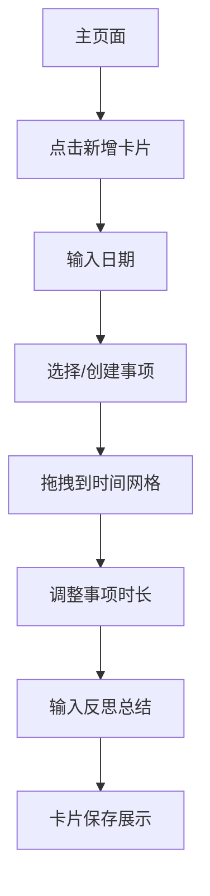

## 1. 产品概述
DailyFlow是一个基于卡片的时间管理工具，采用瀑布流布局展示每日任务安排。用户可以通过拖拽操作在24小时时间格中安排任务，并记录每日反思总结。

目标用户：需要时间管理和日程规划的个人用户，帮助用户直观管理每日时间安排。

## 2. 核心功能

### 2.1 功能模块
DailyFlow包含以下核心页面：
1. **主页面**：卡片瀑布流展示、新增卡片按钮
2. **卡片组件**：日期输入、事项选择、时间网格、反思总结

### 2.2 页面详情
| 页面名称 | 模块名称 | 功能描述 |
|-----------|-------------|-------------|
| 主页面 | 卡片瀑布流 | 展示所有日程卡片，支持瀑布流布局自动排列 |
| 主页面 | 新增卡片按钮 | 点击后在瀑布流顶部创建新的空白卡片 |
| 卡片 | 日期输入 | 文本输入框，用户手动输入日期（如20260107） |
| 卡片 | 事项选择 | 新建事项或选择常用事项，每个事项关联特定颜色 |
| 卡片 | 时间网格 | 8x6网格布局，每个格子代表半小时，共24小时；支持拖拽事项到格子，格子显示事项颜色；拖拽格子边缘可调整事项时长 |
| 卡片 | 状态切换 | 每个卡片显示完成状态，点击可切换为已完成/未完成，已完成卡片显示特殊样式 |
| 卡片 | 反思总结 | 多行文本输入框，记录当日反思和总结 |

## 3. 核心流程
用户操作流程：
1. 用户进入主页面，查看现有卡片瀑布流
2. 点击"新增卡片"按钮创建新卡片
3. 在卡片中输入日期
4. 选择或创建事项（包含颜色标识）
5. 拖拽事项到时间网格，调整占用时长
6. 在反思区域输入总结
7. 卡片自动保存并显示在瀑布流中

## 4. 用户界面设计

### 4.1 设计风格
- **主色调**：蓝色系（#3B82F6）为主，搭配灰色（#6B7280）
- **按钮样式**：圆角矩形，悬停效果
- **字体**：系统默认字体，标题16px，正文14px
- **布局风格**：卡片式瀑布流，自适应网格
- **图标风格**：简洁线性图标

### 4.2 页面设计概览
| 页面名称 | 模块名称 | UI元素 |
|-----------|-------------|-------------|
| 主页面 | 瀑布流 | 卡片宽度固定，高度自适应，自动排列，间距16px；已完成卡片显示绿色边框和勾选图标 |
| 主页面 | 新增按钮 | 圆形按钮，固定在右下角，蓝色背景，白色加号图标 |
| 卡片 | 日期输入 | 单行文本框，边框圆角，占位符显示格式示例 |
| 卡片 | 事项选择 | 下拉选择器，显示事项名称和颜色标识 |
| 卡片 | 时间网格 | 8列6行网格，每个格子48x24px，拖拽时有视觉反馈 |
| 卡片 | 状态切换 | 圆形复选框，位于卡片右上角，点击切换完成状态；已完成显示绿色勾选，未完成显示灰色边框 |
| 卡片 | 反思总结 | 多行文本域，高度120px，支持滚动 |

### 4.3 响应式设计
- 桌面优先设计，支持平板和手机适配
- 瀑布流列数根据屏幕宽度自动调整
- 时间网格在小屏幕下保持可用性

## 5. 数据存储
- 使用MongoDB存储卡片数据
- 每个卡片包含：日期、事项列表、时间安排、反思内容
- 支持数据导出和备份功能