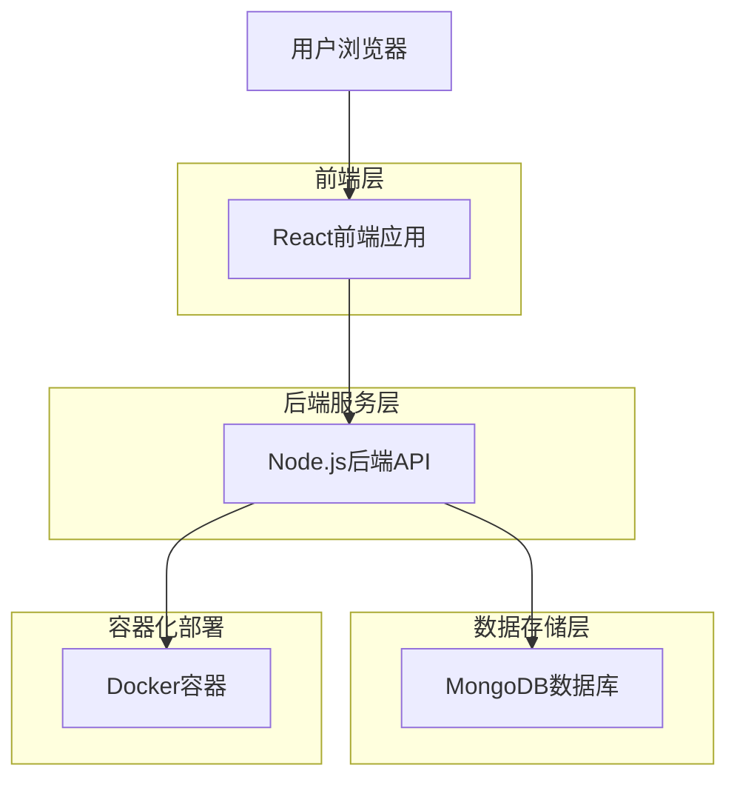
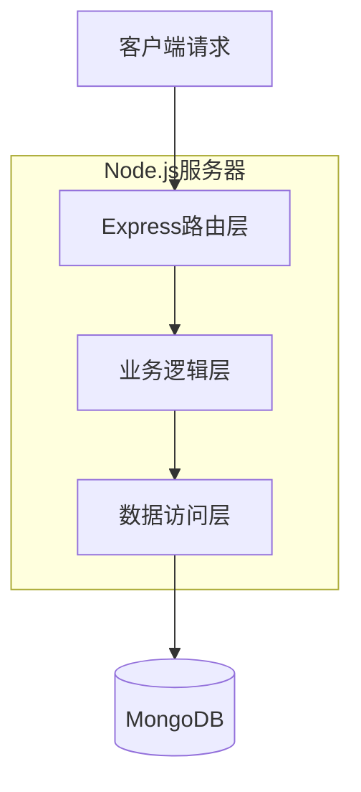
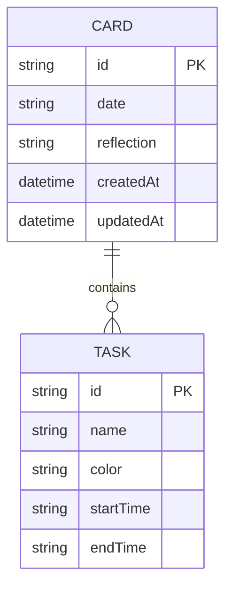

## 1. 架构设计



## 2. 技术栈描述

- **前端**: React@18 + TailwindCSS@3 + Vite
- **初始化工具**: vite-init
- **后端**: Node.js@18 + Express@4
- **数据库**: MongoDB@6
- **容器化**: Docker + Docker Compose

## 3. 路由定义

| 路由 | 用途 |
|-------|---------|
| / | 主页，显示卡片瀑布流 |
| /api/cards | 卡片CRUD操作API |
| /api/tasks | 事项管理API |
| /health | 健康检查接口 |

## 4. API定义

### 4.1 卡片相关API

**获取所有卡片**
```
GET /api/cards
```

响应:
```json
[
  {
    "id": "card_123",
    "date": "20260107",
    "tasks": [
      {
        "id": "task_1",
        "name": "工作",
        "color": "#3B82F6",
        "startTime": "09:00",
        "endTime": "12:00",
        "isCompleted": false
      }
    ],
    "isCompleted": false,
    "reflection": "今日工作效率很高",
    "createdAt": "2026-01-07T10:00:00Z"
  }
]
```

**创建卡片**
```
POST /api/cards
```

请求体:
```json
{
  "date": "20260107",
  "tasks": [],
  "isCompleted": false,
  "reflection": ""
}
```

**更新卡片**
```
PUT /api/cards/:id
```

请求体:
```json
{
  "date": "20260107",
  "tasks": [
    {
      "id": "task_1",
      "name": "工作",
      "color": "#3B82F6",
      "startTime": "09:00",
      "endTime": "12:00",
      "isCompleted": true
    }
  ],
  "isCompleted": true,
  "reflection": "今日工作完成"
}
```

**删除卡片**
```
DELETE /api/cards/:id
```

### 4.2 事项相关API

**获取事项列表**
```
GET /api/tasks
```

**创建事项**
```
POST /api/tasks
```

请求体:
```json
{
  "name": "工作",
  "color": "#3B82F6"
}
```

## 5. 服务器架构图



## 6. 数据模型

### 6.1 数据模型定义



### 6.2 数据定义

**卡片集合 (cards)**
```javascript
{
  _id: ObjectId,
  date: String, // 格式: YYYYMMDD
  tasks: [{
    id: String,
    name: String,
    color: String,
    startTime: String, // HH:mm格式
    endTime: String,    // HH:mm格式
    isCompleted: Boolean // 任务完成状态
  }],
  isCompleted: Boolean, // 卡片整体完成状态
  reflection: String,
  createdAt: Date,
  updatedAt: Date
}
```

**事项集合 (tasks)**
```javascript
{
  _id: ObjectId,
  name: String,
  color: String,
  isCommon: Boolean, // 是否为常用事项
  createdAt: Date
}
```

## 7. Docker配置

### 7.1 Docker Compose配置
```yaml
version: '3.8'
services:
  frontend:
    build: ./frontend
    ports:
      - "3000:80"
    depends_on:
      - backend
  
  backend:
    build: ./backend
    ports:
      - "3001:3001"
    environment:
      - MONGODB_URI=mongodb://mongo:27017/dailyflow
    depends_on:
      - mongo
  
  mongo:
    image: mongo:6
    ports:
      - "27017:27017"
    volumes:
      - mongo_data:/data/db
    environment:
      - MONGO_INITDB_DATABASE=dailyflow

volumes:
  mongo_data:
```

### 7.2 数据持久化
- MongoDB数据通过Docker卷持久化存储
- 支持定期备份和恢复
- 数据文件存储在服务器本地